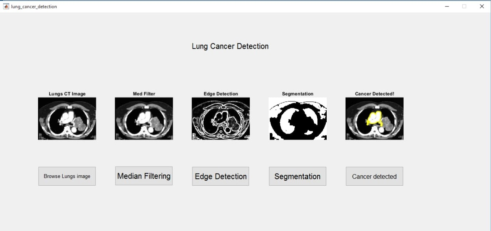

# Lung Cancer Detection GUI using MATLAB

## 🔬 Overview

This project presents a MATLAB-based GUI tool for basic lung cancer detection from CT scan images. It demonstrates fundamental steps in medical image processing and segmentation, designed especially for educational and research applications.

Using simple preprocessing techniques and morphological operations, the GUI provides a visual pipeline.

---

## ⚙️ Features

- **Image Import**: Load lung CT images for processing.
- **Preprocessing**: Convert to grayscale and apply median filtering.
- **Edge Detection**: Detect image boundaries using a Sobel filter.
- **Segmentation**: K-means clustering-based segmentation into four regions.
- **Cancer Detection**: Detects and highlights regions with high solidity and area—potential indicators of malignancy.
- **User Interface**: Easy-to-use GUI developed with MATLAB GUIDE.

---

## 🖼️ GUI Preview



---

## 📁 Folder Structure
lung-cancer-detection-gui/

├── lung_cancer_detection.m # Main MATLAB GUI script

├── lung_cancer_detection.fig # GUIDE-generated figure file

├── README.md # Documentation


---

## 🛠️ Requirements

- MATLAB R2020 or newer
- Image Processing Toolbox
- GUIDE (for GUI development, deprecated in newer versions but still supported)

---

## 🚀 How to Run

1. Open MATLAB.
2. Navigate to the project directory.
3. Run the GUI:
   ```matlab
   lung_cancer_detection

---

## ⚠️ Disclaimer
This tool is a simplified prototype intended only for educational and research purposes. It is not validated for clinical diagnosis or real-world medical applications. Always consult qualified medical professionals for healthcare decisions.

---

## 📚 References
Image Processing Toolbox – MathWorks

Basic image segmentation and morphology techniques

Sample datasets (optional for testing)

---

## 🧠 Future Improvements 
Integrate deep learning models (CNNs) for improved detection accuracy.

Support DICOM image formats commonly used in clinical imaging.

Upgrade GUI using App Designer (for versions after GUIDE deprecation).

Add real-time classification and report generation features.

